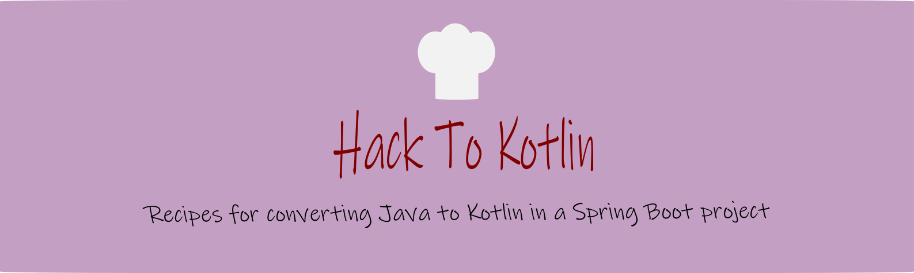

 [](https://github.com/KotlinBy/awesome-kotlin)



We assume that you already have some basic knowledge about Kotlin, but you want to go beyond that and learn how to use
it with Spring Boot.
This workshop is here to help you with that.

*Note*: This project is created as part of the hands-on part of the hack-to-kotlin workshop. You may use it outside the context of the workshop.

## About this workshop

During this workshop you will start with migrating a good old Java Spring Boot Rest service to Kotlin by following recipes.
In the recipes we will touch upon:

- the best practices of using Kotlin,
- the Kotlin utilities you get out-of-the box
- the pitfalls of converting Java code straight to Kotlin,
- Kotlin's interoperability with Java
- neat Kotlin features
- and more!

## The Recipes

### Java-To-Kotlin
The recipes explain step-by-step what needs to be done to migrate the Java code.
Follow the recipes in the right order, and you will be done converting the Java code to Kotlin in no time!

1) [project setup](recipes/java-to-kotlin/1-project-setup/Recipe.md)
2) [domain](recipes/java-to-kotlin/2-domain-models/Recipe.md)
3) [data](recipes/java-to-kotlin/3-data/Recipe.md)
4) [application](recipes/java-to-kotlin/4-application/Recipe.md)
5) [controller](recipes/java-to-kotlin/5-controller/Recipe.md)
6) [service](recipes/java-to-kotlin/6-service/Recipe.md)
7) [test](recipes/java-to-kotlin/7-test/Recipe.md)
8) [finish](recipes/java-to-kotlin/Finish.md)

The complete migrated project you can find [here](java-to-kotlin-complete), feel free to compare your code with the of ours.

## What this workshop is not

Please keep in mind that the goal of this workshop is not to explain Java, Spring Boot modules or any other tool or library, but to expand on
certain aspects that come in play when gradually
migrating a Java Spring Boot project to Kotlin. And be aware that this workshop does not cover what Spring offers! We want to give
you a taste of what is
possible and later extend it based on requests from the community.
This workshop is not perfect! But with your help we can improve it.

---

## Recipe service

The Java Spring Boot project you are going to work on is called the `recipe-service`.
It's a simple REST service that offers crud operation for recipes.

### Api

The `recipe-service` exposes the following endpoints:

````
GET http://localhost:8080/recipes
GET http://localhost:8080/recipes/{id}
POST http://localhost:8080/recipes
PUT http://localhost:8080/recipes
DELETE http://localhost:8080/recipes/{id}
````

### libraries

This project is based `spring-boot-starter-parent` 2.7.4.

---

## Installation

Please have the following software installed:

- Java 11
- Maven v3
- IntelliJ

To test if everything is working execute

```shell 
./mvnw verify
```

This will build the jar and run all tests. You can start the application by running the following command:

```shell
./mvnw spring-boot:run
```

An embedded Tomcat server will start on port ``8080``.

---


In some recipes we have added a section with supplement information about a specific topic.
These section you can recognize by the bulb icon .

---

**Good luck and have fun!**

## Feedback

Let us know what you think about this workshop by filling in this [form](https://forms.gle/NYLUQQYk4YKRGB5DA).
