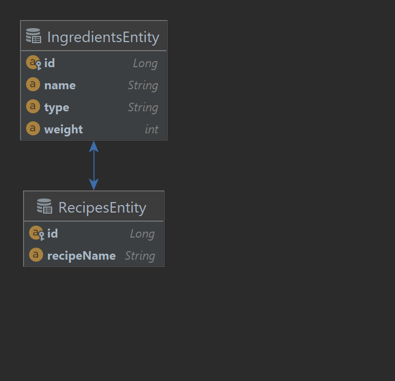

# Setup & design

*Setup*

This project has four layers:

- ``controller`` layer, containing the rest endpoints,
- ``data`` layer containing the JPA entities & repositories,
- the ``service`` layer sits between the ``controller`` and the ``data`` layers.
- And the ``domain`` containing the domain classes.

Recipe Api is powered by Spring Boot:

- Spring Web is used to create the rest endpoints
- Spring Data is used to handle the database communication and connections
- Spring boot validation for validating the beans.

``Lombok`` is used for generating the constructors and the accessors in classes.

As for the database, we will use an in-memory [H2](https://www.h2database.com/html/main.html) database.
For creating the database tables, we will use [flyway](https://flywaydb.org/documentation/getstarted/how) migration tool.
The migration schema can be found [here](../src/main/resources/db/migration/V1_0__recipes.sql)

*Relationship model*

[Go back to the introduction](../ReadMe.md)
