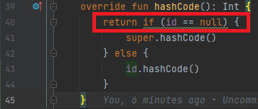

# Data Recipe

The [data](../../../java-to-kotlin/src/main/java/nl/rabobank/kotlinmovement/recipes/data) package has two JPA `entities` and
two `repositories`.
As we have configured `JPA` in the `kotlin-maven-plugin`, only thing we have to do is convert the classes and make some
small adjustments to the
Kotlin code.

## Convert Entities & Repositories

1) Convert the `data` package to Kotlin
2) Refactor the `Entity` classes the following way:
    1) Don't use `data` classes for JPA `entities`, because `entities` are not just regulair DTO's.
    2) Add the `entity` properties to the default constructor
    3) Make all properties immutable (`val`)
    4) Make `id` and `ingridients` nullable
3) There is not much to change in the `Repositories` class, just make the `generic-types` of the
   `JpaRepository` not nullable.
4) For example, after the conversion and refactoring the signature of `IngredientsEntity` class should look like this:

````kotlin
@Entity
@Table(name = "ingredients")
class IngredientsEntity(
   @ManyToOne(optional = false)
   @JoinColumn(name = "recipes_id", nullable = false)
   val recipes: RecipesEntity? = null,
   @Id
   @GeneratedValue(strategy = GenerationType.IDENTITY)
   val id: Long? = null,
   val name: String,
   val type: String,
   val weight: Int,
){..}
````
5) When ready, run all tests:

```shell
   (cd ../../.. && ./mvnw package -pl :java-to-kotlin)
```

[*peek solutions*](../../../java-to-kotlin-complete/src/main/kotlin/nl/rabobank/kotlinmovement/recipes/data)

---


The JPA `Entities` need to
adhere to certain requirement to function properly. Read about the pitfalls of using JPA (Hibernate) with Kotlin [here](https://www.jpa-buddy.com/blog/best-practices-and-common-pitfalls/).

---

<span style="color:green">**_Tip_:**</span> **check if you haven't missed any warnings shown by IntelliJ ;)**




[Go to next section](../4-application/Recipe.md)
